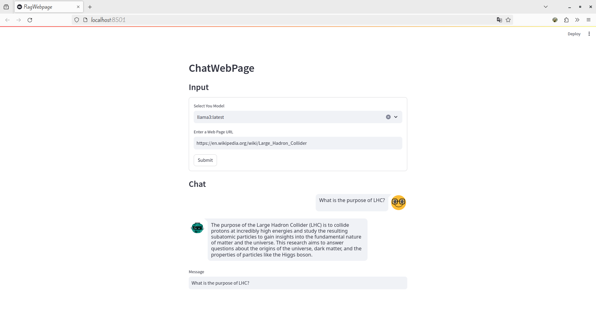

# Ollama RAG Webpage QA
This example provides an interface for asking questions to a Web Page content. 
We will build an application that will read a webpage and answer any question from it. 
Here users can paste any wesite URL (preferably documentation) and ask questions through a straightforward UI. 

## Tech Stack
Our tech stack is super easy with Langchain, Ollama, and Streamlit.  
* **LLM Server:** The most critical component of this app is the LLM server. Thanks to Ollama, we have a robust LLM Server that can be set up locally, even on a laptop.  
* **RAG:** Undoubtedly, the two leading libraries in the LLM domain are Langchain and LLamIndex. For this project, I’ll be using Langchain. An essential component for any RAG framework is vector storage. We’ll be using Chroma here, as it integrates well with Langchain.  
* **Chat UI:** The user interface is also an important component. Although there are many technologies available, I prefer using Streamlit, a Python library, for peace of mind.

## Setup Ollama
As mentioned above, setting up and running Ollama is straightforward. First, visit [ollama website](https://ollama.com) and download the app appropriate for your operating system.

## Install any Ollama model
```
ollama pull llama3
```
Afterward, run the below command to verify if the model was pulled correctly.  
```
ollama list
```

## Setup
Clone this project. Go to project root folder, then install the required libraries:
```
pip install -r requirements.txt
```

## Run
```
streamlit run rag_webpage_st.py
```

A webpage will open on port 8501, where user need to select the ollama model and website URL. Then in the chatbox questions can be asked:  
i.e. - for LHC wikipedia page `What is the purpose of LHC?`

## Screenshot


## Credits
Special Thanks to [this article](https://medium.com/@vndee.huynh/build-your-own-rag-and-run-it-locally-langchain-ollama-streamlit-181d42805895).

